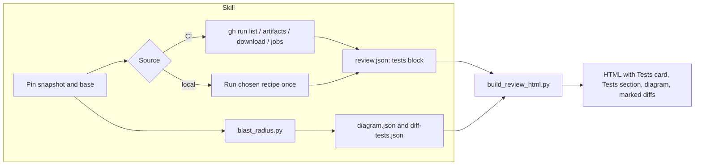

# Design: review-html-tests-diagram

## Overview

Two additions to the shared review renderer and the three review skills: a Tests section fed by JUnit and coverage files that the skills collect from GitHub Actions artifacts or a local run, and a blast-radius diagram rendered as inline SVG from a one-hop dependency graph that a new script derives from git trees. The renderer becomes a package with a thin entry point; the skills gain a shared machine-readable ecosystem file that both the agent and the new script read.

## Architecture

### Components

| Component | Location | Role |
|-----------|----------|------|
| Entry point | `scripts/build_review_html.py` | Argument parsing unchanged; inserts `Path(__file__).resolve().parent` on `sys.path` before `import review_html` (harmless on CPython, needed under `-P` or a file-level symlink) and calls `review_html.render` |
| Renderer package | `scripts/review_html/` | `__init__.py` (exports `render`), `common.py` (`escape`, `file_anchor`, `severity_pill`, `digest`), `inputs.py` (guarded reads), `warnings.py`, `sections.py` (existing renderers), `css.py`, `template.py`, `diffs.py`, `junit.py`, `coverage.py`, `redact.py`, `tests_section.py`, `diagram.py`, `render.py` (the `render()` orchestration). Every module starts with `from __future__ import annotations` |
| Edge discovery | `scripts/blast_radius.py` | Reads two trees, scans imports per `ecosystems.json`, emits `diagram.json` and `diff-tests.json` |
| Ecosystem file | `scripts/ecosystems.json` | One row per language with per-runner test recipes; read by the agent and by `blast_radius.py` |
| Harness | `scripts/tests/`, `Makefile` | `make test` runs `cd scripts && python3 -m unittest discover -s tests -t .`; tests import `review_html` under that one name and invoke the entry point by repo-relative path, never through `~/.claude/scripts` |
| Skills | `claude/skills/{pr-review-html,pr-overview,pre-push-review}/SKILL.md` | Collection steps, JSON blocks, severity floor, corrected rendering contract |

### Data flow



The skill never parses JUnit, coverage, or the diagram. Every input lives in the diff directory `$INPUTS`, where `INPUTS=$CLAUDE_JOB_DIR/review-inputs` or, when `$CLAUDE_JOB_DIR` is unset, `$(mktemp -d)/review-inputs`. All three skills pass `--diff-dir "$INPUTS"` explicitly and reference inputs from the JSON by file name.

### Renderer integration points

`render()` builds a `sections` dict and a `toc_labels` dict, then substitutes into `PAGE_TEMPLATE`. New placeholders are appended to existing placeholder lines, so an empty substitution leaves the old output byte-identical.

| Site | Change | Needs equivalent |
|------|--------|------------------|
| `sections` dict | add `"tests"` and `"diagram"` | yes |
| `toc_labels` | add `"tests": "Tests"`, `"diagram": "Blast radius"` | yes |
| `PAGE_TEMPLATE` body | `$findings_section$tests_section` and `$unresolved_comments_section$diagram_section` on the existing lines | yes |
| `PAGE_TEMPLATE` card grid | `$findings_summary$tests_card` on the existing line | yes |
| fragment loading | one `load_fragments(files, diff_dir, warnings)` call; `build_tests` and `render_files` both consume it | yes |
| `render_files` | takes the loaded fragments and `uncovered: dict[str, set[int]]` | yes |
| `render_important_links`, `build_toc`, footer | unchanged | no |
| `CSS` constant | new rules appended; the constant is a substituted value, so `$` inside it is safe; new rules never go into the template literal | yes |

Call order inside `render()`: load fragments → `build_tests` → `render_diagram` → `render_files` with the uncovered sets → template → print the two summary lines last. Page order: description, commits, explanation, important changes, decisions, findings, tests, unresolved comments, blast radius, per-file diffs, double-check.

`change_classification` is a top-level JSON key. With `docs-only` the Tests card, Tests section, and diagram are all omitted without warnings, whether or not a `tests` block or `diagram_file` is present. The diagram renders whenever `diagram_file` is present and the classification is not `docs-only`.

### Skill integration points

| Skill | Phase | Addition |
|-------|-------|----------|
| pr-review-html | 1 | Record `headRefOid`, `isCrossRepository`, `baseRefName`; after checkout, `git merge-base origin/<base> HEAD`. The skill text states that Phases 4 and 5 run the branch's install scripts and tests on the reviewer's machine, for fork PRs too |
| pr-review-html | 5 | Choose the recipe per §Recipe selection; run once into `$INPUTS`; restore per §Restore; on timeout set `run_outcome: timed_out` and add "fix verification incomplete: test run timed out" to `verdict.detail` |
| pr-review-html | 7 step 1 | Fragments from `git diff <merge-base> -- <path>` on the working tree, replacing `gh pr diff`; untracked files from `git ls-files --others --exclude-standard -z` get fragments from `git diff --no-index /dev/null <path>` and badge `Added` |
| pr-review-html | 7 step 1b | Baseline per §Baseline; `blast_radius.py --repo . --snapshot working-tree --base <merge-base> --tools --out "$INPUTS"` |
| pr-review-html | 7 step 2 | Populate `tests`, `diagram_file`, `change_classification`; apply §Severity floor |
| pr-overview | 1 | Pin `headRefOid`; with a clone, `git fetch origin refs/pull/<n>/head` and verify `git rev-parse FETCH_HEAD` equals the pinned SHA; merge base and fragments from `git diff <merge-base> <sha> -- <path>`; without a clone, merge base from the compare API's `merge_base_commit` and fragments from its `files[].patch`, noting files the API omits (over 300 files, or binary) as fragments missing |
| pr-overview | 1b (new) | §CI artifacts, then §Worktree fallback when permitted |
| pr-overview | 6 step 1b | Baseline; if 1b did not produce a diagram, `blast_radius.py --repo . --snapshot <sha> --base <merge-base>` (clone) or `--remote <owner>/<repo>` (no clone), without `--tools` |
| pr-overview | 6 step 2 | Populate blocks; severity floor |
| pre-push-review | 1 | Base is `origin/<branch>`, or `origin/main` without a tracking branch, unchanged |
| pre-push-review | 5 | As pr-review-html Phase 5 |
| pre-push-review | 7 | Fragments already come from `git diff $BASE -- <path>`; add untracked files as above; `blast_radius.py --repo . --snapshot working-tree --base $BASE --tools --out "$INPUTS"`; populate blocks; severity floor |

All three skills replace the `{repo-root}/.claude/*-diffs/` suggestion with `$INPUTS`, pass `--diff-dir` explicitly, and update their "when to edit the script" paragraph to name the package and `css.py`. pr-overview's paragraph on reading head files via `gh api` is replaced by the fetch and compare-API reads above, and its read-only statement gains the sentence required by requirement 1.3 plus a note that the fetch writes a ref into `.git`. All three rendering-contract sections drop the highlight.js claim and pre-push-review's claim that malformed JSON still renders. Every `gh api` call carries `-R <owner>/<repo>` so it works without a clone, and list endpoints use `--paginate`.

### Recipe selection

The agent reads `ecosystems.json`, detects the language row by the extensions of the changed files (most files wins), and picks a runner within the row by its `detect` rule. Then, reading text only and executing nothing:

1. A Makefile target whose literal recipe lines (read from the Makefile, not expanded) contain one of the runner's `junit_flags`. A recipe whose output path is a `$(VAR)` reference is passed over. The agent runs the target and copies the outputs named in the recipe into `$INPUTS`, reporting them under §Restore.
2. A command in CLAUDE.md or the README described as the test command, if it contains such a flag.
3. The runner's `recipe` with `{junit}`, `{coverage}`, and `{inputs}` substituted with absolute paths under `$INPUTS`, provided every binary in `requires` is on PATH and any `config_files` templates have been written under `$INPUTS`. A missing binary records `required tool missing`; no row or no runner detected records `runner not detected`.

`coverage_scope` is `repository` for tier 3 and `project-configured` for tiers 1 and 2, and the Tests section shows it.

### Restore

Before the run the agent records `git status --porcelain -z` and copies every dirty tracked file to `$INPUTS/pre-run/<path>`. After the run, for each tracked file whose content differs from before: a file clean pre-run is restored with `git checkout -- <path>`; a file dirty pre-run is copied back from `pre-run/`. Untracked files that appeared during the run outside `$INPUTS` are reported, not deleted. Touched and appeared paths go into `tests.run_touched_files`, which the Tests section lists as a warning. `git stash` is never used.

### CI artifacts

```
gh pr view <n> -R <owner>/<repo> --json headRefOid,isCrossRepository,baseRefName,headRepository
gh run list -R <owner>/<repo> --commit <sha> --json databaseId,status,conclusion,name,url
gh api -R <owner>/<repo> --paginate repos/<owner>/<repo>/actions/runs/<id>/artifacts   # name, expired, size_in_bytes
gh api -R <owner>/<repo> --paginate repos/<owner>/<repo>/actions/runs/<id>/jobs        # name, conclusion, html_url
gh run download <id> -R <owner>/<repo> -n <artifact> -D "$INPUTS/artifacts/<id>/<artifact>"
```

Only artifacts with `expired: false` and `size_in_bytes` at most 100 MB are downloaded; larger ones are recorded by name in `tests.skipped_artifacts`. Downloaded files are sniffed: JUnit is XML whose root element is `testsuites` or `testsuite`; Cobertura is XML whose root is `coverage`; lcov starts with `TN:` or `SF:`; coverprofile starts with `mode: `. Recognised files are copied into `$INPUTS` as `<run_id>-<artifact>--<basename>` so two artifacts or two runs cannot collide, and the JSON references those names.

CI state is derived after sniffing, first rule that matches:

1. Any completed run yielded a JUnit file → `artifacts usable`; runs still `in_progress` or `queued` go into `tests.pending_runs`.
2. Any run `in_progress` or `queued` → `run in progress or queued`.
3. No runs → `no run`.
4. At least one artifact exists across completed runs and every one is expired → `artifacts expired`.
5. Any completed run with `conclusion: failure` and zero artifacts → `run failed before upload`.
6. Otherwise → `artifacts absent` (covers artifacts that contain no JUnit).

Job attribution: tokenise job and artifact names to lowercase alphanumeric runs; a file is attributed to the job whose token set is a subset of the artifact's token set, choosing the job with the most tokens; a tie leaves it attributed to the artifact. `test (ubuntu)` → `{test, ubuntu}` matches `test-results-ubuntu`.

### Worktree fallback

Conditions from requirements 1.3, 1.4, and 1.14 hold. One Bash call with the tool's maximum timeout of 600,000 ms; `WT=$CLAUDE_JOB_DIR/wt-<n>-<sha7>`:

```
git worktree prune
git fetch origin refs/pull/<n>/head && test "$(git rev-parse FETCH_HEAD)" = <sha>
git worktree add --detach "$WT" <sha>
(cd "$WT" && <install> && <recipe with absolute $INPUTS paths>); status=$?
python3 ~/.claude/scripts/blast_radius.py --repo "$WT" --snapshot <sha> --base <merge-base> --tools --out "$INPUTS"
git worktree remove --force "$WT"; git worktree prune
echo "recipe-status=$status"
```

`git worktree prune` at the start drops entries whose directories are gone and skips locked ones. The recipe's exit status becomes `run_outcome`. If the call times out, the skill runs the removal lines separately.

### Baseline

Merge base from `git merge-base` with a clone, else the compare API. Candidate runs: `gh run list -R <owner>/<repo> --branch <base> --status success --limit 30 --json databaseId,headSha`. The first candidate whose `headSha` equals the merge base or is its ancestor wins: `git merge-base --is-ancestor <headSha> <merge-base>` with a clone, treating exit status 128 (commit not present locally) as "skip this candidate"; without a clone, `compare/<headSha>...<merge-base>` with `status` of `identical` or `ahead`. A winning run with no usable artifacts ends the search. Its artifacts are downloaded and sniffed as above and referenced as `baseline_junit` and `baseline_coverage`. pre-push-review has no forge and skips this.

### Severity floor

Skill-side rule in each SKILL.md. The renderer prints, as its last two stderr lines, `summary coverage: matched=N unmatched=N` and `summary tests: passed=N failed=N errored=N skipped=N flaky=N`, the latter computed from head JUnit only, whenever a `tests` block is present. The skill greps by the `summary tests:` prefix. If failed or errored is non-zero the skill sets `verdict.tone` to `warning` unless already `error`, prepends the failure count to `verdict.detail`, raises `publish_metadata.severity` to `needs-changes` unless already `blocking`, and renders again to the same output path.

## Components and Interfaces

### `review_html/common.py`

`escape(s)` is `html.escape(s, quote=True)`; `digest(s)` is `sha1(s)[:10]`; `file_anchor(path)` is `"file-" + digest(path)`; `severity_pill` moves here unchanged. Both `sections.py` and `diagram.py` import from here, nothing imports `sections.py` from `diagram.py`.

### `review_html/inputs.py`

```python
def read_guarded(path: Path, warnings: Warnings, xml: bool = False) -> str | None
```

Rejects by `stat` over 50 MB, decodes UTF-8 with a warning on failure, and when `xml` scans the whole buffer for `<!DOCTYPE` and rejects on a match (comments and processing instructions may precede the declaration, so a fixed window could be padded past). Every input read (JUnit, coverage, baseline files, diff fragments, `diagram.json`, `diff-tests.json`) goes through it.

### `review_html/warnings.py`

```python
class Warnings:
    items: list[str]
    def add(self, message: str) -> None   # appends and prints "warning: …" to stderr immediately
```

### `review_html/diffs.py`

```python
def load_fragments(files: list[dict], diff_dir: Path | None, warnings: Warnings) -> dict[str, str]
def added_lines(diff: str) -> set[int]           # new-file line numbers of '+' lines, from @@ headers
def is_binary(diff: str) -> bool                 # a line starting "Binary files " or "GIT binary patch"
def render_diff(diff: str, uncovered: set[int] | None) -> str
```

`render_diff` is the existing `_render_diff` plus hunk tracking: `@@ -a,b +c,d @@` sets the next new-file number to `c`; context and `+` lines advance it; `-` lines do not. A `+` line whose number is in `uncovered` gets class `diff-uncovered` as well as `diff-add`; the CSS draws a 3 px `--error` left border and a `▌` gutter marker. With `None` the output is identical to today. A missing fragment keeps the existing placeholder; an undecodable one gets `(diff fragment 'x' is not UTF-8)`.

### `review_html/junit.py`

```python
@dataclass
class Case:
    suite: str; name: str; outcome: str  # passed|failed|skipped|errored
    flaky: bool; message: str; source: str  # source = input file name, for job attribution

def parse_junit(paths: list[Path], warnings: Warnings) -> list[Case]
```

Per element, first rule that matches: a `failure` child → failed; an `error` child → errored; any of `flakyFailure`, `flakyError`, `rerunFailure`, `rerunError`, `rerun` → passed with `flaky=True`; `skipped` → skipped; else passed. Within one source file, elements sharing (suite, name) collapse to one case whose outcome is the last element's; if any earlier element failed or errored and the last passed, the case is flaky. Identities are never collapsed across sources, since one job each is allowed. `message` is the first failure or error element's `message` attribute, else its text.

### `review_html/coverage.py`

```python
@dataclass
class Entry:
    paths: list[str]         # primary path first, then aliases
    hits: dict[int, int]

Coverage = list[Entry]

def parse_coverage(path: Path, warnings: Warnings) -> Coverage
def apply_path_map(cov: Coverage, strip: str | None, prepend: str | None) -> Coverage
def match(cov: Coverage, changed: list[str]) -> tuple[dict[str, dict[int, int]], dict[str, str]]
    # merged hits per matched changed file; reason per unmatched file: "no candidate" | "ambiguous"
def diff_coverage(added: set[int], hits: dict[int, int]) -> tuple[int, int] | None   # (covered, measurable)
def overall(cov: Coverage) -> tuple[int, int]   # merges entries by normalised primary path first
```

Parsers: lcov reads `SF:` and `DA:line,hits` until `end_of_record`; Cobertura reads `class/@filename` and `lines/line/@number,@hits`, adding `<source>/<filename>` as aliases when `sources/source` elements exist; coverprofile validates `mode:` then reads `file:sl.sc,el.ec stmts count`, assigning `count` to lines `sl..el` and taking the maximum where blocks overlap. `apply_path_map` runs after normalisation on every path including aliases, stripping or prepending whole segments.

`match` is five global passes over normalised paths (`\` → `/`, `posixpath.normpath`, `./` removed):

1. Exact: for each changed file, entries with any path equal to it. An entry whose aliases equal two changed files is ambiguous for both and removed. Matched files merge their entries and are done; matched entries leave the pool.
2. Pools: for each remaining changed file, candidates are remaining entries where the changed path is a whole-segment suffix of the entry path or vice versa. Each candidate records a residual: the direction plus the uncovered segments of the longer path.
3. Shared: an entry present in more than one pool is removed from every pool, once, without cascading. A file whose pool empties here is `ambiguous`.
4. Residuals: a file whose pool has more than one distinct residual is `ambiguous`; an empty pool is `no candidate`.
5. Merge: remaining pools merge by summing hits per line.

Merging happens only in pass 5 and in `overall`, so the order is mapping → matching → merging. `match` returns the unmatched reasons that feed the section and the `summary coverage:` line.

### `review_html/redact.py`

```python
PATTERNS: list[re.Pattern]   # applied in order, each match replaced with "[redacted]"
def redact(text: str) -> str
```

Patterns: `Bearer\s+[A-Za-z0-9\-._~+/]+=*`; `AKIA[0-9A-Z]{16}`; `gh[pousr]_[A-Za-z0-9]{36,}`; `xox[abprs]-[A-Za-z0-9-]+`; `(?i)[A-Za-z0-9_]*(key|token|secret|password|passwd|pwd)["']?\s*[=:]\s*\S+`; `[a-z][a-z0-9+.-]*://[^/\s:@]+:[^@\s]+@`; `-----BEGIN [A-Z ]*PRIVATE KEY-----[\s\S]*?-----END [A-Z ]*PRIVATE KEY-----`. Redaction runs before truncation to 500 characters.

### `review_html/tests_section.py`

```python
@dataclass
class TestsResult:
    card_html: str; section_html: str
    uncovered: dict[str, set[int]]
    counts: dict[str, int]          # passed, failed, errored, skipped, flaky, matched, unmatched

def build_tests(block: dict, files: list[dict], fragments: dict[str, str], diff_dir: Path, warnings: Warnings) -> TestsResult
```

The card matches the existing `.card` markup with three stat `<p>` lines and a section link; with no data it shows `n/a` values and a link to the section. The section contains, in order: provenance with CI link, CI state and fallback state; an availability line (execution outcome, JUnit files found, coverage files found, baseline present); `coverage_scope`; totals with flaky alongside; pending runs; per-job or per-artifact table; failed tests; new and removed tests; per-file diff coverage table, excluding files whose badge is `Deleted` or whose fragment `is_binary`; overall coverage; the `match` unmatched report; `run_touched_files`, `skipped_artifacts`, and warnings. The no-data card reuses `.card` with a `--warning` left border, the treatment used by unresolved-comment cards; the renderer derives its text from `no_data_reason`, `ci_state`, and `fallback_state`, adding the "workflow must upload" sentence when the CI state is `no run`, `artifacts absent`, or `artifacts expired`.

### `review_html/diagram.py`

```python
@dataclass
class Projected:   # nodes per column, collapsed nodes with members, edges, test counts, column status, granularity notes
@dataclass
class Layout:      # boxes by node id, group frames, edge paths, width, height

def project(desc: dict) -> Projected
def layout(p: Projected) -> Layout
def render_diagram(desc: dict, warnings: Warnings) -> str   # section HTML with <style>, scroll container, <svg>, legend, lists
```

Column assignment: a node with status other than `unchanged` is centre; an unchanged node with an edge into a changed node is a dependent; an unchanged node with an edge from a changed node is a dependency; a node with both goes to dependents and its incoming edge is drawn there.

Projection, in order:

1. Test exclusion: `is_test` nodes leave the side columns; each changed node's test count is the number of `is_test` nodes in any column, including changed ones, with an edge to it.
2. Expansion collapse: in each side column, within each group, the nodes whose every edge to the centre has `granularity: "package"` are collapsed into one node when there are more than 3 of them; nodes with any file-granular edge stay. The collapsed node's label is `<group> (N files)`, its id is `digest` of the member paths joined with `\n`, and its ranking key is the sum of its members' edges to changed files.
3. Cap: a side column still over 15 nodes keeps the 15 ranked by `(-edges_to_changed, path)`, path being the first member for a collapsed node, and collapses the rest into a `+N more` node.

Groups within a column are ordered by group name, nodes within a group by path. Same input, same output.

Layout constants:

| Constant | Value | Note |
|----------|-------|------|
| font | 12 px `ui-monospace, "SF Mono", Menlo, monospace` | every text element, including the badge and group labels, declares `textLength` and `lengthAdjust="spacingAndGlyphs"` |
| ADV | 7.2 px | assumed advance for budget arithmetic |
| PAD | 10 px | horizontal box padding each side |
| BOX_H | 26 px | |
| ROW_GAP | 8 px | |
| GROUP_PAD | 8 px | |
| GROUP_HEADER | 18 px | group label row, label budget as the column's |
| GROUP_GAP | 14 px | |
| GUTTER | 56 px | side edges live here |
| LANE | 24 px | centre-to-centre edge lane inside the centre column, right of the boxes, three tracks 6 px apart |
| CONTENT_W | 1036 px | |
| COL_W | 308 px | `(CONTENT_W − 2·GUTTER) / 3` |
| SIDE_BOX_W | 292 px | `COL_W − 2·GROUP_PAD` |
| CENTRE_BOX_W | 268 px | `SIDE_BOX_W − LANE` |
| **Side budget** | **37** | largest L with `L·ADV + 2·PAD ≤ SIDE_BOX_W` (37 → 286.4) |
| **Centre budget** | **30** | largest L with `(L + 4)·ADV + 2·PAD ≤ CENTRE_BOX_W` (30 → 264.8), the 4 reserving the `⚑N` badge |

Boxes are fixed width per column; columns are always `COL_W` wide, so the declared width is `CONTENT_W` and the height is the tallest column. A label over budget is shortened to `…` plus the trailing characters that fit. Each node is a `<g id="n-<digest>">` holding `<title>` with the full path, the `<rect>`, the label `<text>`, and on changed nodes a right-aligned `<text>` reading `⚑N` when N > 0; changed nodes' groups are wrapped in `<a href="#file-<digest>">`. Side edges are cubic beziers with control points at the gutter midpoint, from the source's right-middle to the target's left-middle when the target is to the right, and from the source's left-middle to the target's right-middle otherwise. Centre-to-centre edges leave the source's right-middle, run in the lane on the track chosen by edge index modulo 3, and enter the target's right-middle. Every edge has `marker-end`. Fills and strokes use CSS variables with literal fallbacks (`var(--success, #22C55E)`, `var(--error, #EF476F)`, `var(--accent-3, #4C6CBC)`, `var(--accent-2, #E474E4)`, `var(--surface-2, #142042)`, `var(--border, #26324F)`) so edges and boxes stay visible with the stylesheet removed; collapsed nodes are dashed. A side column with status `failed` shows the reason as wrapped text where its nodes would be; `partial` renders the nodes found plus the reason under the header. A column with any package-granular edge shows "edges at package granularity" under its header.

The SVG sits in `<div class="blast-scroll">` with `overflow-x: auto`. Below it: the legend as a swatch row, then the collapsed-member `<ul>`, then the `skipped` list.

Identifiers: `<digest>` is `common.digest(path)`, so `n-<digest>` and `file-<digest>` share the hash. Edges carry `class="edge e-<src> e-<dst>" data-from data-to`. Per-node hover rules go into a `<style>` inside the section: `.blast:has(#n-x:hover) .edge:not(.e-x){opacity:.15}` and `.blast:has(#n-x:hover) .edge.e-x{stroke-width:2}`. Every path and label passes through `common.escape`.

### `scripts/blast_radius.py`

```
blast_radius.py --repo DIR --snapshot (SHA|working-tree) --base SHA
                [--remote OWNER/REPO] [--ecosystems FILE] [--tools] --out DIR
```

Writes `DIR/diagram.json` and `DIR/diff-tests.json`. Steps:

1. Changed files: `git diff --name-status -M -C -z <base> [<snapshot>]`, mapping `C` to added and `T` to modified, plus `git ls-files --others --exclude-standard -z` as added for the working tree; with `--remote`, the compare API's `files[]` (`status`, `filename`, `previous_filename`). Documentation, data, and asset files (by extension: Markdown, reStructuredText, text, JSON, YAML, TOML, XML, lock files, images, fonts, PDF) are dropped from the changed list and never become nodes or edge endpoints; code in a language without a row is kept. When nothing code-like changed, both columns are `failed: no code files changed`.
2. Tree listing: `git ls-tree -r -l -z <sha>` parsed with `partition("\t")` (mode, size) or `git ls-files -z` plus untracked for the working tree; with `--remote`, `git/trees/<sha>?recursive=1`, and a `truncated: true` response sets both columns to `failed: tree listing truncated`. Skip modes `120000` and `160000`, blobs over 1 MB (recorded in `skipped`), and files whose extension matches no row.
3. Blob reads: one `git cat-file --batch` process for SHA trees; direct disk reads for the working tree; `git/blobs/<sha>` for `--remote`, capped at 500 calls, after which dependents scanning stops with status `partial: remote scan cap reached`. Dependencies need only the changed files' blobs and are unaffected.
4. Group per file from the row's `unit` rule; test flag from `test_files`.
5. Imports scanned with the row's patterns and resolved by the named resolver; edges kept only when they touch a changed file, each carrying `method`, `granularity` (`file` for `relative` and `roots`, `package` for `unit`), and `tree`. Deleted files and renamed old paths are scanned in the base tree with `tree: "base"`. A column with no edges because no row for the changed files has `imports` gets status `failed: no import patterns for <extensions>`; a column with no edges after a complete scan is `complete` and renders empty.
6. With `--tools`, the row's `tool.deps` runs in `--repo` and its edges replace scanned edges for the same pair with `method: "tool:<name>"` and the tool's `granularity` from the row.
7. Diff-derived tests: for each changed test file, the diff of that file is scanned with `test_decl`; names on added lines are `added`, on removed lines `removed`, and test files whose row has no `test_decl` are listed in `unpatterned_files`.
8. Write both files.

Resolvers: `relative` resolves a path relative to the importing file, trying `extension_map` substitutions, then `extensions`, then `index_files`; `roots` splits the import on `separator`, joins under each `source_roots` entry, and retries with the last segment dropped once (a symbol import); `unit` maps an import to a unit directory through the row's `unit` rule and expands to every file in it.

### `scripts/ecosystems.json`

Keys the script reads: `extensions`, `test_files`, `test_decl` (group 1 is the name, else the whole match with the leading keyword removed), `unit` (`kind`: `directory` | `target_root` | `module_file`; `module_file`, `module_regex`, `target_root`), `imports` (`regex`, `resolve`, `separator`), `source_roots`, `index_files`, `extension_map`, `tool` (`name`, `deps`, `format`: `go-list-json` | `pairs`, `granularity`). Keys the agent reads: `runners[]` with `name`, `detect` (`files` globs or `package_json_keys`), `recipe`, `requires`, `coverage_format`, `install`, `junit_flags`, `env`, `config_files`, and the row's `notes`.

```jsonc
{
  "go": {
    "extensions": [".go"], "test_files": ["_test\\.go$"], "test_decl": "^func ((?:Test|Fuzz|Benchmark)\\w+)\\s*\\(",
    "unit": {"kind": "module_file", "module_file": "go.mod", "module_regex": "^module\\s+(\\S+)"},
    "imports": [{"regex": "^\\s*(?:import\\s+)?(?:[\\w.]+\\s+)?\"([^\"]+)\"", "resolve": "unit"}],
    "tool": {"name": "go list", "deps": "go list -json ./...", "format": "go-list-json", "granularity": "package"},
    "runners": [{"name": "gotestsum", "detect": {"files": ["go.mod"]},
      "recipe": "gotestsum --junitfile {junit} -- -coverprofile={coverage} -coverpkg=./... ./...",
      "requires": ["go", "gotestsum"], "coverage_format": "coverprofile", "install": "go mod download",
      "junit_flags": ["--junitfile"]}]
  },
  "typescript": {
    "extensions": [".ts", ".tsx", ".js", ".jsx", ".mjs", ".cjs"],
    "test_files": ["\\.(test|spec)\\.[tj]sx?$", "(^|/)__tests__/"],
    "test_decl": "^\\s*(?:it|test)\\(\\s*['\"`]([^'\"`]+)",
    "unit": {"kind": "directory"},
    "imports": [{"regex": "(?:from|import|require\\()\\s*['\"]([^'\"]+)['\"]", "resolve": "relative"}],
    "index_files": ["index.ts", "index.tsx", "index.js"],
    "extension_map": {".js": [".ts", ".tsx", ".js"], ".jsx": [".tsx", ".jsx"]},
    "runners": [
      {"name": "vitest", "detect": {"files": ["vitest.config.*"]},
       "recipe": "npx --no-install vitest run --reporter=junit --outputFile={junit} --coverage --coverage.reporter=lcov --coverage.reportsDirectory={inputs}/cov",
       "requires": ["npx"], "coverage_format": "lcov", "install": "npm ci", "junit_flags": ["--reporter=junit"]},
      {"name": "jest", "detect": {"files": ["jest.config.*"], "package_json_keys": ["jest"]},
       "recipe": "npx --no-install jest --ci --reporters=default --reporters=jest-junit --coverage --coverageReporters=lcov --coverageDirectory={inputs}/cov",
       "requires": ["npx"], "coverage_format": "lcov", "install": "npm ci", "junit_flags": ["--reporters=jest-junit"],
       "env": {"JEST_JUNIT_OUTPUT_FILE": "{junit}"}}
    ]
  }
}
```

`npx --no-install` fails rather than downloading a runner the project does not declare. Initial rows: Go; Python (`roots` resolver with `source_roots: [".", "src"]`, `separator: "."`, runner pytest with `--junitxml={junit} --cov --cov-report=xml:{coverage}`); TypeScript/JavaScript as above; Swift (`unit` resolver with `target_root: "Sources"`, runner `swift test --enable-code-coverage --xunit-output {junit}` followed by `xcrun llvm-cov export -format=lcov` into `{coverage}`); Rust (`mod\s+(\w+);` with `relative` and `index_files: ["mod.rs"]`, `use crate::` with `roots` and `separator: "::"`, runner nextest with a `config_files` template `nextest.toml` written to `{inputs}` and passed as `--config-file`, run as one `cargo llvm-cov nextest --lcov --output-path {coverage}` command so the suite executes once). Known holes, recorded on the row as `notes`: Swift files inside one target never import each other, so only cross-target edges appear; Xcode projects without `Sources/<Target>` yield no unit and fall to directory grouping; `go list` needs a resolvable module graph and its failure leaves the scanned edges in place with a warning. A row without `runners` still supports diagrams.

## Data Models

### Top-level keys

```jsonc
"change_classification": "code",             // or "docs-only"
"diagram_file": "diagram.json",              // relative to the diff directory
"tests": { … }
```

### `tests` block

```jsonc
"tests": {
  "provenance": {"source": "ci",                     // ci | local
                 "run_ids": [123], "run_urls": ["…"], "timestamp": "…",
                 "snapshot": {"sha": "…", "dirty": false},
                 "ci_state": "artifacts usable",     // no run | run in progress or queued | run failed before upload | artifacts expired | artifacts absent | artifacts usable
                 "fallback_state": "not needed"},    // not needed | ran | blocked by fork PR | blocked by no local clone | blocked by run in progress | timed out
  "baseline_provenance": {"source": "ci", "run_id": 120, "run_url": "…", "sha": "…"},   // or null
  "coverage_scope": "repository",              // repository | project-configured
  "run_outcome": "passed",                     // passed | failed | timed_out | not_run
  "partial": false,
  "junit": ["123-test-results-ubuntu--junit.xml"],
  "coverage": ["123-test-results-ubuntu--coverage.out"],
  "baseline_junit": [], "baseline_coverage": [],
  "path_map": {"strip": null, "prepend": null},
  "jobs": [{"run_id": 123, "name": "test (ubuntu)", "outcome": "success", "url": "…"}],
  "artifacts": [{"name": "test-results-ubuntu", "run_id": 123, "junit": ["123-test-results-ubuntu--junit.xml"],
                 "coverage": ["123-test-results-ubuntu--coverage.out"], "job": "test (ubuntu)"}],
  "pending_runs": [{"run_id": 124, "name": "integration", "status": "in_progress", "url": "…"}],
  "skipped_artifacts": [{"name": "build-output", "size_in_bytes": 412000000}],
  "run_touched_files": [],
  "diff_tests_file": "diff-tests.json",        // or null; written by blast_radius.py
  "no_data_reason": null                       // no tests found | runner not detected | required tool missing | local run failed | local run timed out | ci
}
```

`no_data_reason: "ci"` tells the renderer to derive the reason from the CI and fallback states.

### `diagram.json`

```jsonc
{
  "snapshot_tree": "abc123…",                  // or "working-tree"
  "base_tree": "def456…",
  "nodes": [{"path": "pkg/a.go", "status": "modified", "group": "pkg", "is_test": false, "old_path": null}],
  "edges": [{"from": "cmd/main.go", "to": "pkg/a.go", "method": "expansion", "granularity": "package", "tree": "snapshot"}],
  "column_status": {"dependents": "complete", "dependencies": "complete"},   // complete | partial: <reason> | failed: <reason>
  "skipped": [{"path": "vendor/big.go", "reason": "blob over 1 MB"}]
}
```

`status` is `unchanged` for side-column nodes. `method` is `tool:<name>`, `import`, or `expansion`.

### `diff-tests.json`

```jsonc
{"added": ["TestFoo"], "removed": [], "unpatterned_files": ["spec/foo_spec.rb"]}
```

## Error Handling

`Warnings` is threaded through parsing and rendering; each warning goes to stderr as it happens and is listed at the end of the Tests section. `read_guarded` rejections warn and skip the input. A missing fragment keeps its existing placeholder. An unreadable or invalid review JSON prints one line naming the file and the error and exits with status 2. An invalid or missing `diagram.json` warns and omits the section. The two `summary` lines are printed by `render()` after everything else.

## Testing Strategy

`make test` runs the unittest suite with fixtures in `scripts/tests/fixtures/`. Property-style tests use `random.Random(seed)` generators over 200 cases each.

| Area | Tests |
|------|-------|
| Golden fixture (6.1) | `fixtures/golden.json` exercises every existing section; `fixtures/golden.html` is generated once by running `git show 9da40cf:scripts/build_review_html.py` against it. The test renders with the current package, replaces the `<style>` contents and the `Generated …` footer line in both, and asserts equality |
| JUnit (2.1, 2.2) | nested `testsuites`, empty `classname`, Surefire `flakyFailure` and `rerunFailure`, pytest `rerun` and per-attempt duplicate elements collapsing to one flaky case, `skipped`, message fallback to text |
| Coverage parsers (2.3, 2.4) | one fixture per format, Cobertura with two `source` roots, coverprofile `set` and `count` with overlapping blocks, lcov with repeated `SF:`; `overall` counts each line once |
| Matching (2.5, 2.6) | the five passes, including `util.py` plus `a/util.py` against changed `src/a/util.py` and `src/util.py`, where the shared `util.py` leaves both pools and `a/util.py` matches uniquely; exact wins and leaves the pool; shared candidate removed once without cascade and reported ambiguous; distinct residuals → ambiguous; `path_map` on aliases; property: every changed file maps to at most one merged entry and every entry to at most one file, and the result is independent of input order |
| Diff coverage (2.7) | zero denominator → `None`; aggregate is line-weighted |
| Hunk parsing (3.8) | added line numbers across hunks, renames, `\ No newline` markers; binary detection; `/dev/null` fragments for untracked files |
| Redaction (3.4) | each pattern including `AWS_SECRET_ACCESS_KEY=` and bare `KEY=`; redaction precedes truncation |
| New/removed (2.9, 1.12) | baseline set difference with cross-source note; diff-derived names from `diff-tests.json` |
| Projection (4.6 to 4.8) | test counts include changed test files, collapse only above 3 and only for package-granular nodes, cap ranking with path ties, centre never capped; property: same description twice → identical bytes; random descriptions never yield a side column over 15 or an empty column without a `failed` status |
| Layout (5.4, 5.6, 5.7, 5.9) | property: every `textLength` + 2·PAD ≤ its box width including badges and group labels; budgets compute to 37 and 30; declared width equals 1036; centre-to-centre paths stay inside the lane; changed nodes wrapped in `<a>`; reverse-direction edges attach on the correct sides; every fill and stroke carries a literal fallback |
| Escaping (5.10) | paths containing `<`, `&`, `"`, `$` |
| Error handling (2.10, 2.11) | `read_guarded` on every input type: DOCTYPE rejection, 50 MB rejection via a sparse file, non-UTF-8 fragment; invalid JSON exits 2 |
| Stderr contract (3.12, 2.8) | the two `summary` lines are last even when a diagram warning fires; `summary tests:` excludes baseline cases |
| `blast_radius.py` | a temp repository with `git init` holding Go, Python, TypeScript, and Rust files; edges, methods, granularity, groups, deleted-file edges from the base tree, untracked files as added, copies and type changes, test flags, 1 MB skip recorded, `diff-tests.json` contents, `column_status` values |
| Timing (2.12) | generated 10 MB lcov and 5,000-case JUnit; skipped when `os.getloadavg()` is unavailable or its first value exceeds the CPU count |
