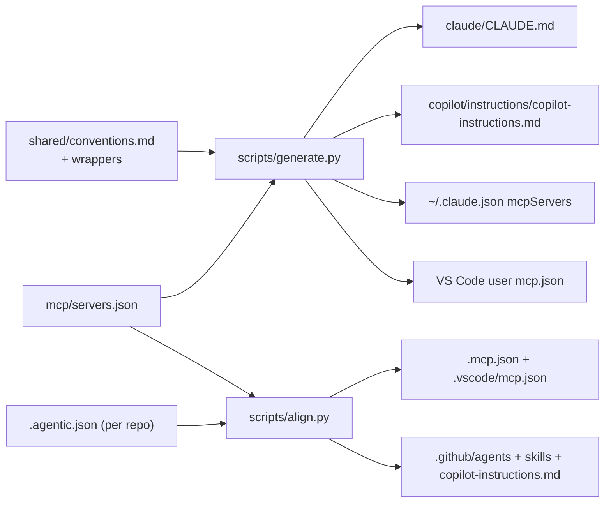

# Design: toolset-agnostic-starwave

## Overview

The repository gains a generated layer: shared convention fragments, a canonical MCP definition, and Copilot assets are sources; a small Python toolchain produces every per-tool shape from them. A new PRD lane (one skill to author, one skill to execute) rides on the fact that Copilot natively consumes the same Agent Skills standard Claude Code uses.

## Architecture

### Repository layout changes

```
agentic-coding/
├── Makefile                      # NEW: generate / sync / align / lint targets
├── Brewfile                      # NEW: gh, uv, node, podman, go, arjenschwarz/rune/rune
├── shared/
│   ├── conventions.md            # NEW: single-source core conventions (Req 3.3)
│   ├── claude-wrapper.md         # NEW: Claude-only sections (AskUserQuestion contract, skill routing)
│   └── copilot-wrapper.md        # NEW: Copilot-only preamble
├── mcp/
│   └── servers.json              # NEW: canonical MCP definitions (Req 4.1)
├── claude/
│   ├── CLAUDE.md                 # GENERATED (checked in): conventions + claude wrapper
│   └── skills/
│       ├── prd/SKILL.md          # NEW: PRD authoring skill (Req 1)
│       └── engage/SKILL.md       # NEW: PRD execution skill (Req 2; working name)
├── copilot/
│   ├── agents/prd.agent.md       # NEW: custom agent wrapper for VS Code + cloud
│   ├── instructions/copilot-instructions.md   # GENERATED (checked in)
│   └── prompts/                  # DELETED: all 8 stale gated-lane files (Req 3.2)
└── scripts/
    ├── bootstrap.sh              # NEW: one-script machine setup (Req 8)
    ├── sync-claude.sh            # existing links unchanged (Req 9.1); ADDS VS Code profile links (Req 3.1)
    ├── generate.py               # NEW: conventions + MCP generation (Req 3.3, 4)
    ├── stale-packs.json          # NEW: SHA-256 list of known stale agent-pack files
    └── align.py                  # NEW: per-repo alignment command (Req 5, 6)
```

Generated files are checked in so consumers stay symlink-only and diffs review like any other change. `make generate` rebuilds them; `make lint` fails if they drift from their sources (same check runs in the align command for this repo).

### Source-of-truth flow



### Surface discovery map (Req 3.4)

| Asset | Claude Code | VS Code Copilot | Cloud coding agent |
|---|---|---|---|
| Skills (`SKILL.md`) | `~/.claude/skills` symlink (existing) | reads `~/.claude/skills` natively | `.github/skills/` seeded by align |
| PRD custom agent | n/a (skill suffices) | symlink in VS Code profile `User/prompts/` → repo `copilot/agents/prd.agent.md` (created by **sync-claude.sh**, so a sync-only machine discovers it per Req 3.1); `chat.agentFilesLocations` as fallback if profile discovery fails — verify during implementation | `.github/agents/` seeded by align |
| Instructions | `~/.claude/CLAUDE.md` symlink | `chat.instructionsFilesLocations` → repo `copilot/instructions/` (the generated Copilot file; `chat.useClaudeMdFile` stays OFF — it would deliver the Claude wrapper to Copilot, defeating Req 3.3); repo-level via seeded `.github/copilot-instructions.md` | `.github/copilot-instructions.md` seeded by align |
| MCP | `~/.claude.json` (user) / `.mcp.json` (repo) | user + `.vscode/mcp.json` | paste-ready JSON + runbook (Req 6.2) |

## Components and Interfaces

### PRD authoring skill — `claude/skills/prd/SKILL.md` (Req 1)

One Agent Skill, consumed by Claude Code and VS Code directly and seeded into `.github/skills/prd/` for the cloud agent. Content adapts the old `~/.copilot/agents/prd.agent.md` outline, restructured for derivability:

- Sections: product summary; goals / non-goals; **functional requirements grouped by context** (one H2 per application/module of the target repo, each with numbered MUST/SHOULD requirements and acceptance criteria); execution notes (quality gates, STOP tasks); explicitly NO user-personas/metrics boilerplate unless the author asks.
- Output: `specs/{prd-name}/prd.md` in the target repo. One PRD, one repo (Decision 11).
- The GitHub-issue-creation step from the old agent is dropped (tasks come from rune derivation instead).

`copilot/agents/prd.agent.md` is a thin `.agent.md` wrapper (name, description, `tools: ["search", "edit", "web"]`) that instructs following the skill's outline — needed because the agent picker (VS Code) and agents panel (cloud) select agents, not skills.

### PRD execution skill — `claude/skills/engage/SKILL.md` (Req 2)

Claude Code skill; orbit is the non-Claude local executor; cloud native-loop execution needs no component (the PRD file plus seeded instructions are the interface, Decision 9).

Behavior contract:
1. **Derive** (idempotent): read `specs/{prd-name}/prd.md`; for each context H2, create `specs/{prd-name}/tasks-{context}.md` via `rune create` + `rune batch` — phases per requirement cluster, streams where tasks within a context are independent, `--reference prd.md` front matter. Context slug = H2 text lowercased, non-alphanumerics collapsed to `-`. PRD execution notes requiring human verification become `STOP —` prefixed tasks. Skips contexts whose task file already exists (re-running derives only missing contexts; it never rewrites an in-progress file).
2. **Execute**: contexts run in parallel, one worktree per context (`.claude/worktrees/prd-{prd-name}-{context}`, branch `prd/{prd-name}-{context}`), one subagent per context applying the make-it-so delegation loop against its own task file (streams within the file give intra-context parallelism). Make-it-so's semantics are reused **with context-qualified naming**: inner stream branches/worktrees become `stream/{context}-<phase>-<N>` — branches are repo-global, so the unqualified make-it-so names would collide the moment two contexts each have streams. Subagent Commit Conventions apply unchanged, except no subagent or context touches `CHANGELOG.md` — engage writes one PRD-level changelog entry after integration.
3. **STOP protocol** (Req 2.5): a context subagent halts at a `STOP —` task and returns `blocked-at-STOP` with the task id. Interactive run (skill invoked in a Claude session): engage asks the user, then re-dispatches the context. Headless run (engage invoked with `--headless`, which is also what orbit's non-interactive command uses): the STOP task and its dependents stay not-started and are reported blocked.
4. **Integrate**: context branches merge back in completion order; a merge conflict stops integration and is reported (never auto-resolved across contexts). After all merges, the quality gates run once on the integrated branch — a context passing in isolation does not make the PRD complete (Req 2.6).
5. **Complete + report** (Req 2.6, 2.7): per context — all rune tasks complete, gates pass (with "no quality gates ran" noted when there is no Makefile), merged and committed; plus the integrated-branch gate above. Final report = contexts completed / incomplete / blocked (including blocked-at-STOP).

Derive-time guard: two context H2s producing the same slug abort derivation with both headings named.

Orbit path (documented in the skill and README, not code): one orbit process per context, each in its **own worktree** — orbit refuses a second process per checkout via `.orbit/run.lock`, so `--tasks-file` alone does not give parallelism.

### Conventions generation (Req 3.3)

`generate.py` concatenates `shared/conventions.md` between wrapper fragments:
- `claude/CLAUDE.md` = conventions + `shared/claude-wrapper.md`
- `copilot/instructions/copilot-instructions.md` = `shared/copilot-wrapper.md` + conventions

Contract: wrappers own all tool-specific text; `conventions.md` must render correctly in both outputs, so it references no tool-specific mechanisms (no skill names, no AskUserQuestion) **and no Claude-tree file paths** (`rules/references/...`, `.claude/scripts/...` — such references live in the claude wrapper only; the conventions test asserts none survive into the Copilot output).

**Managed-block provenance (used by every generated/seeded markdown and JSON-adjacent file):** generated content sits between `<!-- agentic:begin -->` / `<!-- agentic:end -->` markers. Generators and align rewrite only the block; content outside it is preserved verbatim. This solves two otherwise-fatal interactions: Claude Code's `#`-memory appends to `~/.claude/CLAUDE.md` (the generated file) survive regeneration as tail content, and repo-specific additions to a seeded `.github/copilot-instructions.md` survive re-alignment. A target file that exists **without** markers is treated as hand-written: reported and skipped, never overwritten (Req 8.4). `make lint` warns when tail content in `claude/CLAUDE.md` looks like a convention that belongs in `shared/`.

### MCP generation (Req 4)

`mcp/servers.json` schema (per server):

```json
{
  "devtools": {
    "transport": {"type": "stdio", "command": "mcp-devtools",
                   "env": {"ENABLE_ADDITIONAL_TOOLS": "sequential_thinking,gemini-agent,codex-agent"}},
    "secrets": {},
    "surfaces": ["claude", "vscode", "cloud"],
    "default_for": ["*"]
  },
  "github": {
    "transport": {"type": "http", "url": "https://api.githubcopilot.com/mcp/"},
    "secrets": {"AUTH_TOKEN": {"header": "Authorization"}},
    "surfaces": ["claude", "vscode", "cloud"],
    "default_for": []
  }
}
```

- `surfaces` handles per-surface applicability (e.g. awesome-copilot: `["vscode"]`).
- `default_for` drives first-run manifest inference in align (glob/marker rules, e.g. svelte → `svelte.config.js` present).
- Secret mapping (Req 4.3): claude/`.mcp.json` targets emit `${VAR}` env expansion; VS Code targets emit `inputs` prompt entries; the cloud artifact names `COPILOT_MCP_*` secrets. A secret with no mechanism for a requested target aborts generation with a named error.
- Commands are written portably: bare command names (PATH-resolved), never absolute user paths (Req 5.1's target state).

Write behavior (Req 4.5): for `~/.claude.json` (which holds unrelated Claude state) and all `mcp.json` shapes, the generator parses existing JSON, replaces only canonical-named server entries, preserves everything else, and prints preserved non-canonical entries. Missing file → created; invalid JSON at a target → backed up alongside (`.bak-<date>`) and regenerated, reported. For the Claude user scope specifically, the generator prefers `claude mcp add-json <name> <json> --scope user` when the CLI is on PATH (avoids racing a running Claude Code instance that rewrites `~/.claude.json`), falling back to direct merge otherwise.

Cloud artifact (Req 6.2): `align.py --cloud-mcp` prints the paste-ready cloud-agent MCP JSON for the repo's manifest subset with `COPILOT_MCP_*` secret names; the application steps live in `docs/runbooks/cloud-agent-mcp.md`.

### Alignment command — `scripts/align.py <repo-path>` (Req 5, 6)

Reads `.agentic.json` in the target repo; when absent, infers defaults from `default_for` rules and writes it (first run is also the opt-in moment: the manifest is left for the user to commit).

```json
{"servers": ["devtools", "svelte"], "cloud_assets": true}
```

Fix pipeline, in order, each step reported per file (managed files only — enumerated in Data Models):
1. JSON validity — unparseable managed config backed up and regenerated from canonical + manifest, with a warning that non-canonical entries may remain only in the `.bak`.
2. Path portability — user-specific absolute paths in managed files rewritten to `$HOME`/bare-command forms.
3. MCP convergence — canonical entries converged, non-canonical preserved (same writer as generate.py).
4. Duplicated agent packs — files under `.github/agents/` whose SHA-256 matches `scripts/stale-packs.json` are deleted; anything else is left and reported. The checksums are derived from the actual bytes in rtob/workscripts during implementation, and align warns when a repo has `.github/agents/` files but zero pack matches (a near-miss must not silently no-op).
5. Cloud seeding (when `cloud_assets: true`) — copy `copilot/agents/prd.agent.md` → `.github/agents/`, generated instructions → `.github/copilot-instructions.md`, `claude/skills/prd/` → `.github/skills/prd/`. Seeded files carry the managed-block markers; subsequent runs converge only the block (drift class 5 in the idempotence contract), preserving repo-local additions outside it. A pre-existing file without markers: reported and skipped, never overwritten.

First run on a repo with no `.agentic.json`: align infers the manifest, writes it, and prints the plan **without applying** — the user reviews/commits the manifest, and the next run (or `--yes`) applies. A wrong inference never touches `.github/` before it has been seen.

Idempotence (Req 5.3) is a hard contract: the second applying run must produce an empty report; the test suite enforces it on every drift fixture.

### Bootstrap — `scripts/bootstrap.sh` (Req 8)

Order: Homebrew present? (install if not) → `brew bundle` (Brewfile includes the `visual-studio-code` cask and codex CLI alongside gh, uv, node, podman, go, rune; Claude Code installed via its documented installer step) → `go install` for orbit and mcp-devtools → `mkdir -p ~/.claude` and the VS Code `User/` settings dir (fresh machine: neither exists before first app launch) → `sync-claude.sh` → `generate.py --user` (user-level MCP + conventions + the VS Code `settings.json` key merge — bootstrap.sh does no JSON manipulation itself, per Decision 12's rationale) → remove `~/.copilot/agents/prd.agent.md` if present (Req 1.4, reported) → print remaining manual steps (gh auth login, `claude` login, Copilot sign-in, GitHub MCP token, `codex login` for peer review), ending with "re-run bootstrap.sh after authenticating" so auth-skipped steps complete.

VS Code seeding merges keys into the user `settings.json` (preserving all others): `chat.instructionsFilesLocations` → the generated `copilot/instructions/` (never `chat.useClaudeMdFile` — see surface map), the PRD agent symlink into the profile `User/prompts/` dir (fallback: `chat.agentFilesLocations`), and the localml provider under `github.copilot.chat.customOAIModels` (baseUrl `http://127.0.0.1:8080/v1`, model id placeholder). The API key lives in VS Code secret storage and cannot be file-seeded — the runbook covers that prompt (any non-empty string; localml ignores it).

Steps that need authentication before it exists (private resources) are skipped with a report and appended to the manual-steps list (Req 8.1).

### localml runbook — `docs/localml-vscode.md` (Req 7)

Step-by-step only: start command, Manage Language Models entries, API-key placeholder, model picking. References the seeded settings entry as the already-done part.

## Data Models

- `.agentic.json` — `{servers: string[], cloud_assets: bool}`. Committed per repo.
- `mcp/servers.json` — schema above; the only hand-edited MCP file anywhere. `default_for` grammar: an array of marker-file globs evaluated against the repo root (`"svelte.config.js"`, `"*.go"`); the literal `"*"` means always included.
- Align's managed files (the complete set steps 1–5 may touch): `.mcp.json`, `.vscode/mcp.json`, `.agentic.json`, `.github/copilot-instructions.md`, `.github/agents/prd.agent.md`, `.github/skills/prd/**`, plus stale-pack files under `.github/agents/`. Nothing else in a target repo is read or written.
- PRD spec folder — `specs/{prd-name}/prd.md` + `tasks-{context}.md` per context (rune format, phases + streams, front-matter reference to `prd.md`).

## Error Handling

- generate.py: unmappable secret → abort with server + target named (Req 4.3); invalid target JSON → backup + regenerate + report.
- align.py: unknown server name in `.agentic.json` → error listing canonical names; non-git directory → refuse.
- bootstrap.sh: per-step failure reports and continues where later steps are independent (brew formula failure must not block symlinks); unauthenticated-only steps skip with report.
- engage: context subagent failure surfaces per make-it-so convention (stop that context, report; other contexts continue).

## Testing Strategy

Python tests (stdlib `unittest`, run via `make test`) with golden-file fixtures:

- **Generator**: each target shape from a fixture `servers.json` → golden output; secret-mechanism failure case; preservation of non-canonical entries and unrelated `~/.claude.json` keys.
- **Align**: one fixture repo per drift class (stale path, invalid JSON, drifted canonical entry, stale agent pack, missing cloud assets, **hand-edited seeded file with local additions outside the managed block**, **markerless pre-existing file**) → fixed state matches golden; **idempotence property on every fixture: second applying run reports zero changes** (Req 5.3). The invalid-JSON fixture asserts the report warns about possible non-canonical entries in the `.bak`.
- **Conventions**: Copilot output contains no Claude-only wrapper content and no Claude-tree path references; both outputs contain the shared block verbatim; tail content outside the managed block survives regeneration.
- **Shell**: `shellcheck` on bootstrap.sh/sync-claude.sh in `make lint`; bootstrap gets a `--dry-run` flag, and AC 8.2 is verified by a second real run on the configured machine reporting no changes during rollout.
- **Backwards compat (Req 9.1)**: test asserts sync-claude.sh's link map is unchanged and `claude/skills/` contains every pre-feature skill directory name.
- **PRD lane**: skill documents are exercised by a worked example in a scratch repo during rollout; the example MUST have at least two contexts each with streams, so the context-qualified branch naming is actually exercised.
